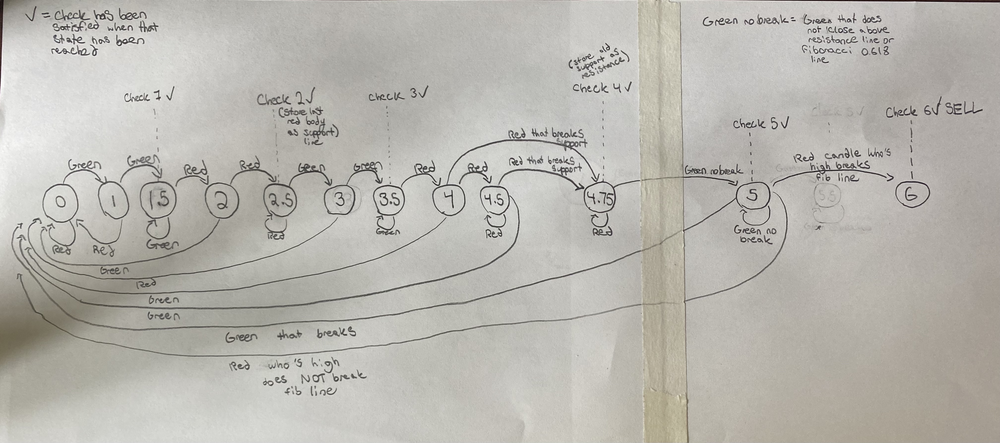

# ForexTradingAlgo

As the spiritual successor to the Cryptocurrency Algorithmic Trader, this program takes what was learned there and innovates. While still providing automated and scheduled algorithmic market analysis, this program provides a platform based around finite state machines that streamlines the development of trading strategies, allowing for rapid creation and testing. It's flying instead of walking. 

Breakdown of the finite state machine algorithm in layman's terms : 

The most powerful feature of the program is the infrastructure to quickly and effciently build customizable finite state machines, which translate into strategies.
Here is an example of one of these finite state machines, and it is most fleshed out one that has been built so far in the program. 

Here is an explanation of the above finite state machine:

FSM = Finite state machine 

The example strategy's goal is to sell a currency pair, after meeting a series of requirements. 

There are 12 states that must be passed through before the pair can be sold. These states are numbered 0-6, with decimal increments, such as 1, 1.5, 2, 2.5 etc. 

For a state to move to the next state, a requirement must be met (ex: such as the next candle stick being green)

A state can move forward or backwards, if the requirement to move backwards is met, it will move backwards. 

A state can transition back to itself (stay in the same state) if that requirement is made. 

Not all state transitions are linear, what I mean by that, is state 4 can go to state 0 if that transition exists and the requirements are met (usually only backwards transitions can skip states in this particular FSM). 

There are decimal increments and not just whole number incremements because some states are require the same signals as the previous state, just multiple of them. For example, states 1 and 1.5 both require the next candlestick to be green in order to advance to the next state. These repeated requirements happen mutliple times in this particular strategy. In real life, you would say "Our signal is 2 green candles," so in this program, state 1 and state 1.5 are like sister states and come together to form a signal, each needing 1 green candle for a total of 2 green candles. The "Checks" simply seperate these sister states. 

Once certain states are reached, sometimes certian pieces of information are stored to help inform future state transition requirements. For example after state 2.5 is reahced, the top of body of the last red candlestick is stored as the "support line." This support line is used later to determine is a state should transition. A "-" below will denote when information needs to be updated. 

Here is a breakdown of the state transitions 

0 -> 1 means if that requirement is met it moves from state 0 to state 1  
0 -> 0 means if that requirement is met it simply stays in the 0 state.  

When I say "green candlestick" or "green" what that means is to transition states the next candle must be a green candle.  
The picture above is better for visulization, however this is more clear. I would recommend following along with the picture first.   

0 : Starting state  
0 -> 1 : Green Candlestick  
0 -> 0 : Red Candlestick  

1 -> 1.5 : Green  
1 -> 0 : Red  

1.5 -> 2 : Red  
1.5 -> 1.5 : Green  

2 -> 2.5 : Red  
2 -> 0 : Green  

- When 2.5 is reached store the top of the last red body as support line

2.5 -> 3 : Green  
2.5 -> 2.5 : Red  
- If 2.5 to 2.5, update support line 

3 -> 3.5 : Green  
3 -> 0 : Red  

3.5 -> 4 : Red  
3.5 -> 3.5 : Green  

4 -> 4.75 : Red candle that breaks down through the support line  
4 -> 4.5 : Red  
4 -> 0 : Green  

4.5 -> 4.75 : Red that breaks down and closes through the support line  
4.5 -> 4.5 : Red  
4.5 -> 0 : Green  

- Store the old support line as the new resistance line 

4.75 -> 5 : Green no break (Green candle that does not close above resistnace line or fib 0.618 line)  
4.75 -> 4.75 : Red  

5 -> 6 : Red candle whos high breaks the fib 0.618 line  
5 -> 5 : Green no break  
5 -> 0 : Green that breaks  
5 -> 0 : Red who's high does not break the fibonacci line  

6 : FINAL STATE , sell the currency pair  

Buy back strategy : currently the only buy back strategy is buying back after a certange percentage profit is made, or a certain percentage of profit is lost. 

Strategy in english : 
There must be two or more green candles, followed by two or more red candles, followed by two or more green candles. Then there must be a at least one red candle, followed by a red candle that closes below the support line. Then there can be as many red candles after this, but eventually there must be a green candle, that does not close above the resistance line. Then there must be a red candle who's high breaks the fib 0.618 line. Then we sell the currency. 

